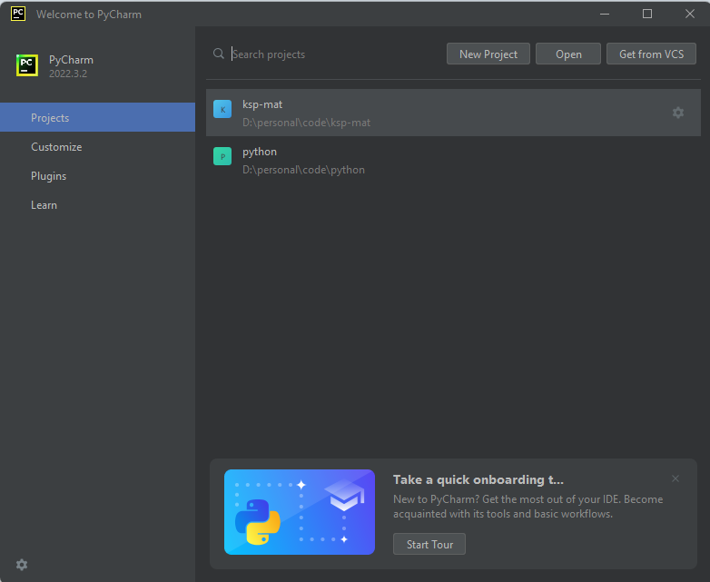
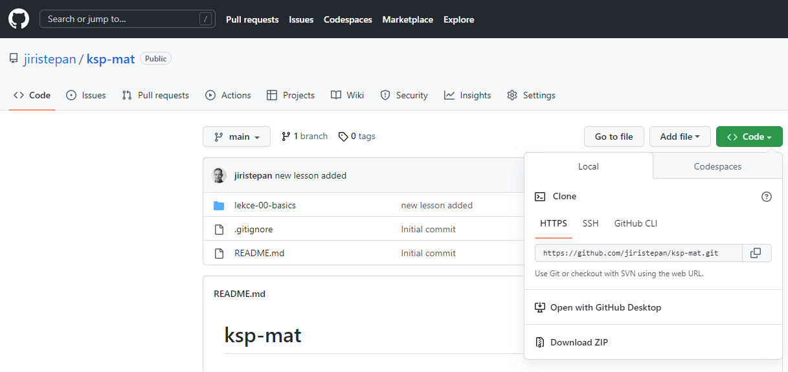
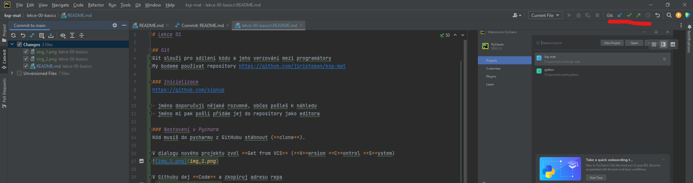

# Lekce 01

## Git
Git slouží pro sdílení kódu a jeho verzování mezi programátory
My budeme používat repository https://github.com/jiristepan/ksp-mat

### Inicializace
https://github.com/signup

- jméno doporučuji nějaké rozumné, občas pošleš k náhledu
- jméno mi pak pošli přidám jej do repository jako editora

### Nastavení v Pycharm
Kód musíš do pycharmu z GitHubu stáhnout (**clone**).

V dialogu nového projektu zvol **Get from VCS** (**V**ersion **C**ontrol **S**ystem)

V Githubu dej **Code** a zkopíruj adresu repa
 

Tu vlož do dialogu Pycharmu a vyber kam se má stáhnout na lokálním disku.
 

A je to.

### Práce
Normálně tvoříš a upravuješ kód. Když je to hotové použij tlačítka nahoře.

- **Update project** - stáhne k tobě to co udělali jiní
- **Commit** - přidej svoje změny do systému s poznámkou co jsi udělal (ale ještě je nenahrávej na server)
- **Push** - nahraj commitnuté na server pro ostatní. Před prvním **push** se budeš muset přihlásit

Práce je celkem jednoduchá:
- při otevření si stáhni změny. Programuj a pak dej commit a push, když jsi hotov.

Postupně se naučimě další triky. Pracovat s historií a vytvářet více verzí kódu.

## Input output

## Python basics